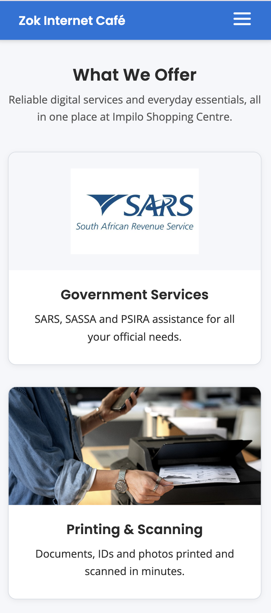
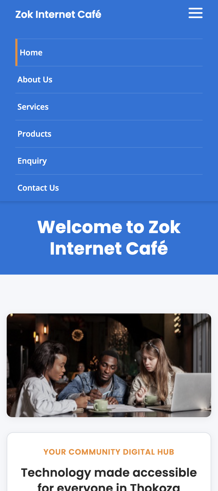
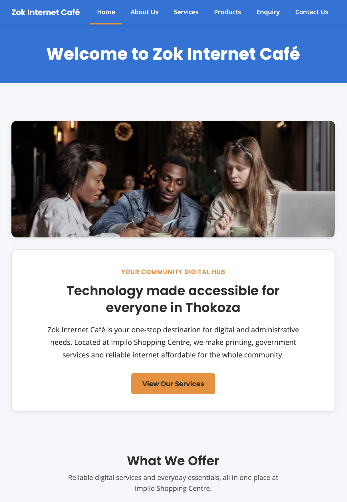
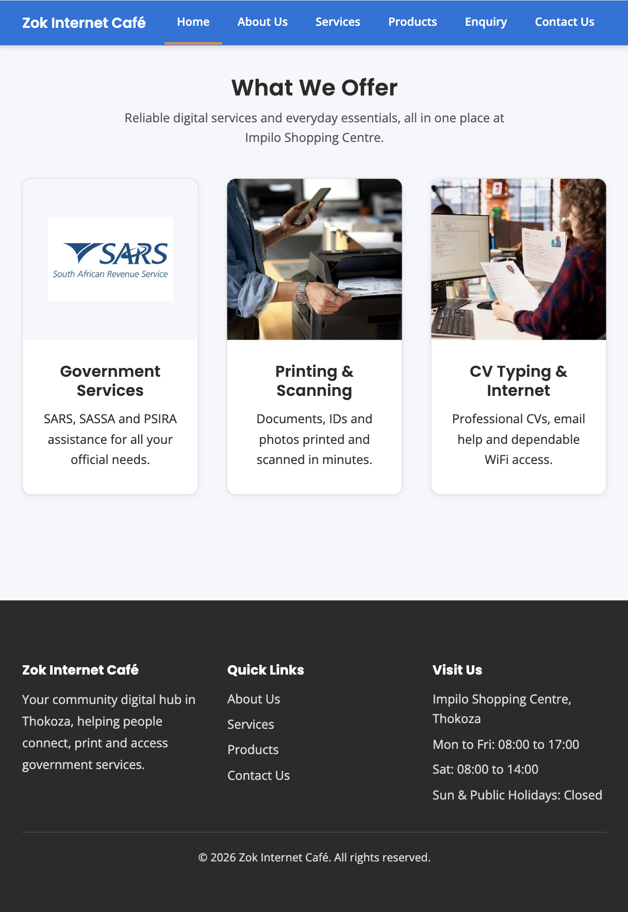
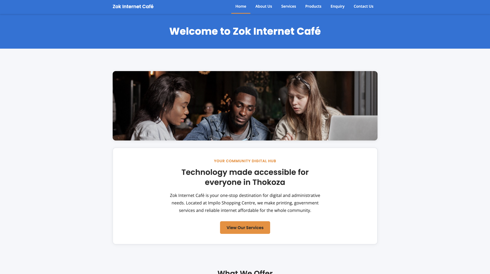
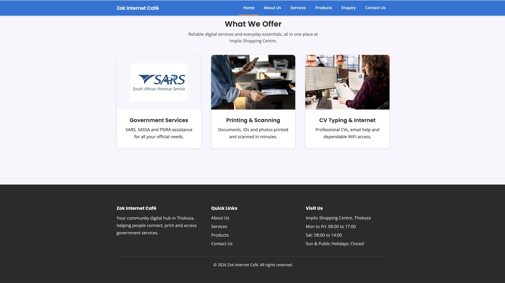

# Zok Internet Café Website

---

## Project Overview

This project involves designing and developing a fully functional, multi-page website for Zok Internet Café, a community-focused digital services business based in Thokoza, South Africa. The website is being built as part of the WEDE5020w module and will be completed across three submission phases.

The café currently has no online presence and relies entirely on physical marketing such as pamphlets, posters, and word-of-mouth. This website aims to change that by giving the business a professional digital identity that the local community can access at any time.

---

## Student Information

**Full Name:** Axole Yokwana  
**Student Number:** ST10515746  
**Module:** WEDE5020w  
**Live Deployment:** [https://axoleyokwana.github.io/ST10515746_WEDE5020w_POE/](https://axoleyokwana.github.io/ST10515746_WEDE5020w_POE/)

---

## Website Goals and Objectives

**Goals:**
- Establish a professional online presence for Zok Internet Café.
- Centralise all service and pricing information in one place.
- Increase public awareness of government-related services offered, including SARS e-Filing, SASSA applications, and PSIRA registrations.
- Build trust with potential customers before they visit the café in person.

**Objectives:**
- Reach 200 or more unique local visitors within the first two months of launch.
- Reduce in-store enquiries about pricing and availability by at least 30% within three months.
- Automate the enquiry process for specialised services via an online contact form.
- Ensure all key information is reachable within two clicks from the homepage.
- Grow the café's social media following by linking to the WhatsApp contact page.

---

## Key Features and Functionality

The website consists of six fully styled pages:

- **index.html** - Homepage with a responsive hero image, tagline, introductory copy, a "View Our Services" call-to-action button, and a three-column "What We Offer" card grid.
- **about.html** - Business history, orange mission and vision blocks, community involvement cards, and a three-member team grid with portrait photos.
- **services.html** - Six service cards in a responsive grid, each with an image, description and starting price, plus a full-width "Enquire Now" call-to-action bar.
- **products.html** - Products grouped under four categories (Stationery, Tech Accessories, Airtime and Data, Refreshments) in a two-column product grid, plus a "Visit Us In-Store" banner.
- **enquiry.html** - Centred enquiry form with a two-column name row, service type dropdown, message field and styled submit button.
- **contact.html** - Two-column layout with a contact form on the left and contact details, WhatsApp link and embedded Google Map on the right.

**General features include:**
- Fully responsive design for mobile (600px), tablet (768px) and desktop, with a CSS-only hamburger navigation menu on small screens.
- Sticky Digital Blue navigation bar and consistent three-column footer on every page.
- External stylesheet (`css/style.css`) with CSS custom properties, Grid, Flexbox and media queries — no inline or internal styles.
- Google Fonts (Poppins for headings, Open Sans for body text) loaded with preconnect for faster rendering.
- Hover, focus and active states on links, buttons, cards and form fields for accessibility.
- Responsive hero image with `picture`, `srcset` and `sizes` for optimised loading on mobile data connections.
- High-contrast brand colours and readable typography throughout.
- Alt text on all images for screen reader compatibility.

---

## Technical Stack

| Technology | Purpose |
|---|---|
| HTML5 | Semantic page structure |
| CSS3 | Styling, Flexbox/Grid layouts, media queries, animations |
| JavaScript | Interactive elements, form validation, DOM manipulation |
| jQuery 3.7.1 | Accordion, tabs, lightbox and AJAX helpers (loaded from CDN) |
| Leaflet.js 1.9.4 | Interactive OpenStreetMap on the contact page (loaded from CDN) |
| Google Fonts | Poppins and Open Sans typefaces |
| GitHub Pages | Free static site hosting |
| Visual Studio Code | Primary development IDE |

**Colour Palette:**
- Primary: Digital Blue `#0A74DA`.
- Background: Cloud White `#F5F7FA`.
- Accent: Sunrise Orange `#F28C28`.
- Text: Charcoal Black `#2B2B2B`.

---

## Timeline and Milestones

### Part 1 - HTML Foundation

| Week | Dates | Deliverable |
|---|---|---|
| 1 | 23 Feb 2026 | Project proposal, initial file structure, GitHub setup |
| 2 | 02 Mar 2026 | Sitemap, wireframes, content gathering, image sourcing |
| 3 | 09 Mar 2026 | HTML structure for all 6 pages, semantic tags, navigation |
| 4 | 16 Mar 2026 | HTML content completed, cross-browser testing, validation |
| 5 | 20 Apr 2026 | Final testing, README update, **Part 1 submission (20 April)** |

### Part 2 - CSS and Responsive Design

| Week | Dates | Deliverable |
|---|---|---|
| 6 | 26 Apr 2026 | External stylesheet, CSS reset, typography and colour setup |
| 7 | 05 May 2026 | Grid/Flexbox layouts, hover states, pseudo-classes |
| 8 | 12 May 2026 | Media queries, mobile and tablet layouts, image optimisation |
| 9 | 19 May 2026 | Final responsive testing, cross-device checks, **Part 2 submission (19 May)** *(completed 28 May 2026)* |

### Part 3 - JavaScript and Final Polish

| Week | Dates | Deliverable |
|---|---|---|
| 10 | 09 Jun 2026 | jQuery and Leaflet CDN setup, interactive accordion, tabs and lightbox |
| 11 | 16 Jun 2026 | Form validation (enquiry and contact), search filter, scroll animations, SEO |
| 12 | 18 Jun 2026 | Final testing across all devices, README update, **Part 3 submission (18 June)** |

---

## Part 1 Details

Part 1 focuses on the planning and HTML foundation of the website. The following has been completed:

- Project proposal document submitted, covering the organisation overview, website goals, current website analysis, proposed features, design decisions, technical requirements, timeline, budget, content sourcing strategy, and sitemap.
- GitHub repository created and configured.
- Initial file and folder structure set up.
- Wireframes designed for all six pages.
- Sitemap finalised.

**File Structure:**

```
Zok-internet-cafe/
├── index.html
├── about.html
├── services.html
├── products.html
├── enquiry.html
├── contact.html
├── robots.txt
├── sitemap.xml
├── css/
│   └── style.css
├── images/
│   ├── hero-cafe-collaboration.png
│   ├── hero-cafe-collaboration-800.png
│   ├── hero-cafe-collaboration-480.png
│   ├── responsiveness-desktop-1.png
│   ├── responsiveness-desktop-2.png
│   ├── responsiveness-ipad-1.png
│   ├── responsiveness-ipad-2.png
│   ├── responsiveness-s25-1.png
│   ├── responsiveness-s25-2.png
│   └── (service, product and team images)
└── js/
    ├── main.js
    └── form-validation.js
```

---

## Part 2 Details


Part 2 adds the full visual layer and responsive behaviour on top of the Part 1 HTML foundation. All styling is handled by a single external stylesheet linked from every page. The following has been completed:

### CSS Foundation

- **External stylesheet:** `css/style.css` is linked to all six pages via `<link rel="stylesheet">`. There are no inline styles or internal `<style>` blocks anywhere in the project.
- **CSS custom properties:** Brand colours, max-width and page gutter spacing are defined once in a `:root` block and reused across the stylesheet.
- **CSS reset:** A universal reset clears default margins and padding and sets `box-sizing: border-box` so layouts are consistent across browsers.
- **Typography:** Poppins is used for headings and Open Sans for body text, both loaded from Google Fonts with `preconnect` hints. A typography scale sets font sizes, weights, line height and letter spacing from H1 down to button text.
- **Reusable container:** A `.container` class centres content at a max-width of 1100px with consistent horizontal padding.
- **Smooth scrolling:** `scroll-behavior: smooth` is applied to the `html` element.

### Shared Components (All Pages)

- **Sticky navigation bar:** Digital Blue background with white links, box shadow, and an orange underline on the active page link. On screens 600px and below, the nav collapses into a CSS-only hamburger menu using a checkbox toggle — no JavaScript required.
- **Page header band:** A full-width Digital Blue heading strip below the nav displays the page title in white centred text.
- **Buttons:** Sunrise Orange `.btn-primary` buttons with rounded corners, hover darkening, focus styles and a subtle active press effect.
- **Site footer:** A three-column Charcoal Black footer on every page with a business description, Quick Links list (including Enquiry), and Visit Us details (address and operating hours). A copyright line sits below a divider.
- **Form styling:** Labels, inputs, selects and textareas share consistent padding, borders and border-radius. Focus states use a Digital Blue border and soft glow for keyboard accessibility.

### Page-by-Page Styling

**Homepage (`index.html`)**
- Hero section with the café image displayed above the text in a stacked layout (image banner with rounded corners and shadow, followed by a white content card).
- Orange uppercase tagline, centred heading, intro paragraph and "View Our Services" button inside the hero card.
- "What We Offer" section with a three-column card grid. Cards have white backgrounds, borders, shadows and a hover lift effect. Logo cards (SARS) use `object-fit: contain` so logos are not cropped.

**About Us (`about.html`)**
- Centred intro section for the business history.
- Mission and Vision displayed in two equal columns as Sunrise Orange blocks with white text.
- Community involvement shown as two side-by-side cards with 16:9 images and descriptive text below.
- Team section with a three-column grid. Portrait photos are uniform rounded rectangles with a Digital Blue border, displayed above each member's name, role and bio.

**Services (`services.html`)**
- Centred service introduction paragraph.
- Six service cards in a three-column grid, each with an image, title, description and blue starting price. Logo cards (SARS, PSIRA) keep logos fully visible with `object-fit: contain`. Cards have hover lift effects.
- Full-width Charcoal Black "Enquire Now" call-to-action bar at the bottom with an orange button linking to the enquiry page.

**Products (`products.html`)**
- Centred "Shop With Us" introduction.
- Products grouped under four category headings: Stationery, Tech Accessories, Airtime and Data, and Refreshments.
- Each category uses a two-column product grid with horizontal cards (thumbnail image beside name and price).
- Full-width Sunrise Orange "Visit Us In-Store" banner at the bottom with stock availability notice.

**Enquiry (`enquiry.html`)**
- Centred "Make an Enquiry" introduction.
- Enquiry form inside a white `.form-card` with shadow and rounded corners, constrained to 640px width.
- First name and last name fields sit side by side in a two-column `.form-row` that stacks on mobile.
- Service type dropdown with eight options and a styled submit button.

**Contact Us (`contact.html`)**
- Centred "Get In Touch" introduction.
- Two-column `.contact-grid`: contact form on the left, contact information on the right.
- Contact details include phone, WhatsApp link, email, location and operating hours.
- Embedded Google Map iframe with rounded corners below the contact details.

### Image Handling

- All content images use `object-fit: cover` and `aspect-ratio` so cards and photos stay uniform without stretching.
- Logo images use `object-fit: contain` with padding so SARS and PSIRA logos display in full.
- Hero image uses a `<picture>` element with `srcset` and `sizes`, serving three optimised variants:
  - `hero-cafe-collaboration-480.png` for mobile (600px and below)
  - `hero-cafe-collaboration-800.png` for tablet (900px and below)
  - `hero-cafe-collaboration.png` (1024px) for desktop

---

## Sitemap

```
HOME
├── ABOUT
│   ├── History of the Business
│   ├── Mission and Vision
│   ├── Community Involvement
│   └── Our Team
├── SERVICES
│   ├── Printing
│   ├── Scanning
│   ├── SARS e-Filing
│   ├── CV Typing
│   ├── PSIRA Registration
│   └── Other Services
├── PRODUCTS
│   ├── Stationery
│   ├── Tech Accessories
│   ├── Airtime and Data
│   └── Refreshments
├── ENQUIRY
│   ├── Enquiry Form
│   └── Service Selection Options
└── CONTACT
    ├── Contact Details
    ├── Contact Form
    ├── Location Map
    └── Operating Hours
```

---

## Part 3 Details

Part 3 adds JavaScript interactivity, client-side form validation, search engine optimisation and dynamic content features to the website. Two JavaScript files are loaded on every page via `<script>` tags before the closing `</body>` tag. jQuery 3.7.1 is loaded from a CDN for interactive elements, and Leaflet.js 1.9.4 is loaded on the contact page for the interactive map.

### JavaScript Foundation

- **jQuery 3.7.1:** Loaded from the official jQuery CDN on all six pages. Used for the FAQ accordion, product tabs, lightbox gallery and form validation helpers.
- **Leaflet.js 1.9.4:** Loaded from the unpkg CDN on the contact page only. Leaflet CSS is linked in the `<head>` and the JavaScript file is loaded before `main.js`.
- **main.js:** Shared script loaded on every page. Handles the accordion, tabs, lightbox, search filter, Leaflet map initialisation, scroll-in animations and back-to-top button.
- **form-validation.js:** Loaded on the enquiry and contact pages only. Handles client-side validation, error messages and form submission responses.

### Interactive Elements

- **FAQ Accordion (services.html):** Five frequently asked questions are displayed below the service grid. Clicking a question toggles the answer open with jQuery `slideToggle()`. Only one answer is visible at a time. A plus/minus icon indicates the open state.
- **Product Tabs (products.html):** A tab bar above the product categories allows filtering by category (All Products, Stationery, Tech Accessories, Airtime and Data, Refreshments). Clicking a tab shows the matching category with a jQuery `fadeIn()` transition and hides the rest.
- **Image Lightbox Gallery (about.html):** Clicking any community or team photo opens it in a full-screen overlay. A close button and clicking the dark overlay background close the lightbox. The Escape key also closes it.
- **Interactive Map (contact.html):** An interactive Leaflet map using OpenStreetMap tiles replaces the previous Google Maps iframe. A marker with a popup shows the café location at Impilo Shopping Centre, Thokoza. No API key is required.
- **Scroll-in Animations:** Sections with the class `.animate-on-scroll` start with zero opacity and slide upwards as they enter the viewport. The `IntersectionObserver` API triggers the animation once per element.
- **Back-to-Top Button:** A circular orange button appears in the bottom right corner after the user scrolls past 400 pixels. Clicking it smoothly scrolls the page back to the top.

### Dynamic Content and Search

- **Live Search Filter (services.html):** A search input above the service grid filters cards in real time as the user types. The filter matches against each card's text content, hiding non-matching cards instantly.
- **Product Tab Filtering (products.html):** Product categories are dynamically shown and hidden using jQuery DOM manipulation when the user selects a tab.

### Form Validation

- **Enquiry Form (enquiry.html):** The form collects first name, last name, email, contact number, service type and an optional message. JavaScript validates each field on blur and again on submit. Validation includes character length checks, South African phone number format (10 digits starting with 0), and email format. Inline error messages appear below invalid fields in red. On successful validation, a response modal displays the user's name, selected service and relevant pricing or availability information.
- **Contact Form (contact.html):** The form collects name and surname, email, message type (General Enquiry, Complaint, Feedback, Partnership), subject and message. JavaScript validates all fields on blur and submit. On successful validation, the form data is compiled into a `mailto:` link addressed to `zokinternatecafe@gmail.com` with the subject and body pre-filled. The user's email client opens with the message ready to send. A success modal confirms the action.
- **Error Handling:** Invalid fields receive a red border (`.input-error`) and valid fields receive a green border (`.input-success`). Error messages are displayed in `<span class="error-msg">` elements below each field.

### Search Engine Optimisation (SEO)

- **Meta Descriptions and Keywords:** Every page has a unique `<meta name="description">` and `<meta name="keywords">` tag in the `<head>` with relevant content for search engine indexing.
- **Title Tags:** Each page has a descriptive `<title>` tag following the format "Page Name | Zok Internet Café".
- **Header Tags:** All pages use a single `<h1>` in the page header band, with `<h2>` and `<h3>` tags used for content hierarchy.
- **Image Optimisation:** All images have descriptive file names and alt text. The hero image uses responsive `srcset` and `sizes` attributes.
- **URL Structure:** Clean, descriptive file names (e.g. `services.html`, `enquiry.html`) are used for all pages.
- **Internal Linking:** The footer Quick Links section on every page links to all other pages. The services page links to the enquiry page, and the homepage links to the services page.
- **Mobile-Friendliness:** The website is fully responsive with CSS media queries for mobile (600px) and tablet (768px) breakpoints.
- **robots.txt:** A `robots.txt` file in the root directory allows all search engine crawlers to index all pages and references the sitemap.
- **sitemap.xml:** An XML sitemap lists all six pages with last modified dates, change frequency and priority values to help search engines understand the site structure.

---

## Changelog

Please view the full history of changes in the [CHANGELOG.md](CHANGELOG.md) file.

---

## Responsiveness of the Website

The website has been thoroughly designed and tested to ensure optimal display and functionality across all device sizes, from mobile phones to large desktop monitors. The following demonstrates the responsive behaviour on different screen sizes.

### Mobile

**Device:** Samsung S25 Ultra (360px - 600px)





The mobile layout demonstrates the fully responsive design on a modern Android flagship device. The navigation collapses into a hamburger menu, all multi-column layouts stack to a single column, and images and text scale appropriately for smaller screens.

**Key Features:**
- Hamburger menu navigation with collapsible links
- Single column layout for all cards and content
- Reduced font sizes and padding for compact display
- Full-width images and components
- Touch-friendly button sizes
- Responsive hero image (480px variant)

**Screenshot 1 - What We Offer on Samsung S25 Ultra:**
Shows the homepage with the hamburger menu closed. The "What We Offer" cards stack vertically in a single column with full-width images.

**Screenshot 2 - Mobile Menu Expanded:**
Shows the navigation menu expanded with all links visible, demonstrating the CSS-only hamburger toggle functionality with an orange accent on the active page link.

### Tablet

**Device:** iPad Air (768px - 1023px)





The tablet breakpoint activates at 768px width, reducing font sizes slightly and adjusting multi-column grids for optimal viewing on medium-sized screens. Key responsive changes include:

**Layout Adjustments:**
- Service and product grids shift from 3 columns to 2 columns for better spacing
- Mission and vision blocks, community cards, and contact grids collapse to single column
- Footer maintains 2-column layout for readability
- Hero image height adjusted to 15rem
- Increased padding to balance larger screen real estate

**Homepage on iPad Air:**
Shows the full homepage layout with the sticky navigation bar displaying all menu links inline with an orange underline on "Home". The hero section displays the café image and the welcome card with call-to-action button. Below shows the "What We Offer" section with cards in a responsive layout.

**Screenshot 2 - What We Offer and Footer on iPad Air:**
Demonstrates the three-column card grid and three-column footer on a tablet screen, with Quick Links and Visit Us information displayed side by side.    

### Desktop

**Device:** MSI MP2412W (1024px and above)





The desktop layout displays the full three-column grid layouts, larger typography, and all components at their optimal sizes:

- Full 3-column grids for services, products, and community cards
- Mission and vision blocks display side-by-side in orange containers with white text
- Team members show in a 3-column grid with equal-height cards
- Sticky navigation bar and three-column footer provide consistent navigation and information
- Hero image displayed at full 1024px variant
- Maximum content width of 1100px with comfortable padding on all sides
- Hover effects on cards and buttons enhance interactivity

---

## References

ColorHunt, n.d. *Color Palettes for Designers and Artists*. [Online]. Available at: https://colorhunt.co. [Accessed 10 April 2026].

CSS-Tricks, n.d. *A Complete Guide to Flexbox*. [Online]. Available at: https://css-tricks.com/snippets/css/a-guide-to-flexbox/. [Accessed 12 May 2026].

CSS-Tricks, n.d. *A Complete Guide to Grid*. [Online]. Available at: https://css-tricks.com/snippets/css/complete-guide-grid/. [Accessed 12 May 2026].

FreePik, n.d. *Images*. [Online]. Available at: https://www.freepik.com. [Accessed 10 April 2026].

GitHub, n.d. *GitHub Pages Documentation*. [Online]. Available at: https://docs.github.com/en/pages. [Accessed 10 April 2026].

Google Fonts, n.d. *Free Fonts Library*. [Online]. Available at: https://fonts.google.com. [Accessed 10 April 2026].

Host Africa, n.d. *Domain Registration in South Africa*. [Online]. Available at: https://hostafrica.co.za/domains/. [Accessed 10 April 2026].

jQuery Foundation, n.d. *jQuery API Documentation*. [Online]. Available at: https://api.jquery.com/. [Accessed 10 June 2026].

Leaflet, n.d. *Leaflet — an open-source JavaScript library for interactive maps*. [Online]. Available at: https://leafletjs.com/. [Accessed 10 June 2026].

MDN Web Docs, n.d. *CSS: Cascading Style Sheets*. [Online]. Available at: https://developer.mozilla.org/en-US/docs/Web/CSS. [Accessed 5 May 2026].

MDN Web Docs, n.d. *Client-side form validation*. [Online]. Available at: https://developer.mozilla.org/en-US/docs/Learn/Forms/Form_validation. [Accessed 12 June 2026].

MDN Web Docs, n.d. *Intersection Observer API*. [Online]. Available at: https://developer.mozilla.org/en-US/docs/Web/API/Intersection_Observer_API. [Accessed 12 June 2026].

MDN Web Docs, n.d. *Responsive images*. [Online]. Available at: https://developer.mozilla.org/en-US/docs/Web/HTML/Responsive_images. [Accessed 12 May 2026].

MDN Web Docs, n.d. *Using media queries*. [Online]. Available at: https://developer.mozilla.org/en-US/docs/Web/CSS/Media_Queries/Using_media_queries. [Accessed 12 May 2026].

OpenStreetMap, n.d. *OpenStreetMap*. [Online]. Available at: https://www.openstreetmap.org/. [Accessed 10 June 2026].

PSIRA, n.d. *PSIRA Online Services*. [Online]. Available at: https://www.psira.co.za/. [Accessed 10 April 2026].

SARS, n.d. *SARS e-Filing Portal*. [Online]. Available at: https://www.sars.gov.za/. [Accessed 10 April 2026].

W3Schools, n.d. *CSS Tutorial*. [Online]. Available at: https://www.w3schools.com/css/. [Accessed 5 May 2026].

W3Schools, n.d. *JavaScript Tutorial*. [Online]. Available at: https://www.w3schools.com/js/. [Accessed 10 June 2026].
